React &amp; Redux To-do List
===

Following this tutorial you'll review those topics:

- Setup a React App using React Script  
- Writing HTML with JSX
- Adding SCSS to React  
- Using Font Awesome with React 
- Creating React components   
- Understanding the state  
- Persisting data with localStorage
- Routing with React Router    
- Implementing Redux  
- Usage of Redux Dev Tools

Check the live [Demo](https://fbw-12.github.io/react-redux-introduction/)


# 1. Real World Showcase

Let's see how React is used in the final to-do application and how the component based approach fits to the real world. We will have a look at nested components and how they share a state to store application data.

Please open the demo of our [What to do?](https://fbw-12.github.io/react-redux-introduction/) app in your browser.

Use the [React Developer Tools](https://chrome.google.com/webstore/detail/react-developer-tools/fmkadmapgofadopljbjfkapdkoienihi) for Google Chrome to check the state of the __App__ component and fiddle around with the data to see how changes take effect.

The following image shows how the components are splitted in the app.

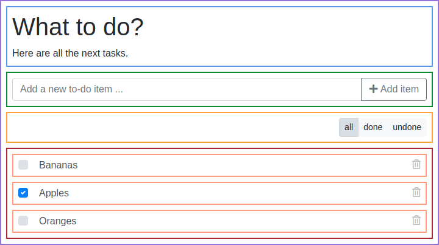


# 2. Setting up our own App with `React Scripts`

[React Scripts](https://github.com/facebook/create-react-app/blob/master/packages/react-scripts/template/README.md) is an npm package that is developed and maintained by the core React developers at Facebook. It helps to simplify the initial setup of React applications with Webpack, Babel and many more useful tools and features.

## 2.1 Creating the folder structure

The first thing we need to do is to create the folder structure, that our application will use. The folder structure of projects you will work on in your career as a developer might be different, but the following one is a common solution.

```
- react-todo-list
  - public
  - src
    - components
    - modules
    - sass
```

## 2.2 Creating a package.json

The second thing we need to do is to create a `package.json` file, that is located in the root directory of our project. This is just a minimal version, that gets extended in the next chapters.

```
package.json
```

```JSON
{
  "name": "react-todo",
  "version": "1.0.0",
  "description": "A todo application using the basics of React and Redux",
  "scripts": {
    "start": "react-scripts start",
    "build": "react-scripts build",
    "eject": "react-scripts eject"
  },
  "devDependencies": {
    "react": "^16.8.6",
    "react-dom": "^16.8.6",
    "react-router-dom": "^5.0.0",
    "react-scripts": "^3.0.1"
  },
  "browserslist": [
    ">0.2%",
    "not dead",
    "not ie <= 11",
    "not op_mini all"
  ]
}
```

## 2.3 Installing packages

We use [npm](https://www.npmjs.com/) to install all needed packages for our project.

```bash
npm install
```

## 2.4. Creating an index.html file

We will use a simple HTML file, to load our React application. We create the file `public/index.html` that will automatically be loaded, when we start the application, using [`React Scripts`](https://github.com/facebook/create-react-app/blob/master/packages/react-scripts/template/README.md).

```
public/index.html
```

```html
<!DOCTYPE html>
<html lang="en">
  <head>
    <meta charset="utf-8" />
    <meta
      name="viewport"
      content="width=device-width, initial-scale=1, shrink-to-fit=no"
    />

    <title>What to do?</title>
  </head>

  <body>
    <div id="main"><!-- This is where the React app is loaded --></div>
  </body>
</html>
```


# 3. Creating the first component

There are two types of components in React, that we will talk about in this tutorial. We will start with `class components`, to show many of the features that components can have.

__Class components__ are extending the `React.component` class and offer a lot of features, like the `State` we will talk about later. They are the solution for more complex components.

__Stateless function components__ are using a function to return the rendered JSX, do not use a state and are faster to load.

## 3.1 Hello World

[React Scripts](https://github.com/facebook/create-react-app/blob/master/packages/react-scripts/template/README.md)  will look for an `src/index.js` file by default, so let's create this and write our first component in there. We will move the component to its own file in another step, but keep it simple for now.

```
src/index.js
```

```jsx
import React from "react";
import { render } from "react-dom";

render(<p>Hello World!</p>, document.querySelector('#main'));
```

Let's see what we got there.

1. We import React from its npm package.
1. We import ReactDOM to render our components to the HTML DOM.
1. We render a paragraph into our __#main__ DIV element.

Now, that we've got something we want to render, let's start our React application with the following command.

```bash
npm start
```

The result should look like this:

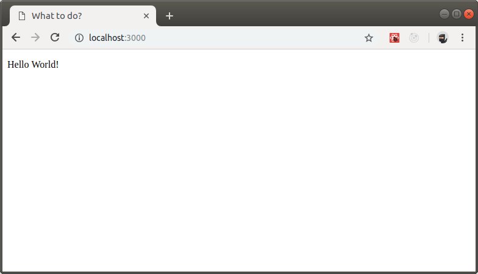

If you get an error on Ubuntu, stating that there would not be enough disk space or the limit of inodes would be reached, run the following command in your terminal.

```bash
echo fs.inotify.max_user_watches=524288 | sudo tee -a /etc/sysctl.conf && sudo sysctl -p
```

Okay, so we're able to render something into our DOM. The result should be a nice paragraph with the text "Hello World!".

## 3.2 A header component

Now, that we've seen that everything works in general, let's add the class for our first component. We will name it "Header" and use it to display the top part of our application.

Every class component that we create needs to have the `render()` method, that returns [JSX](https://reactjs.org/docs/introducing-jsx.html), which is the template language of React.

```
src/index.js
```

```jsx
import React from "react";
import { render } from "react-dom";

class Header extends React.Component {
  render() {
    return <h1>What to do?</h1>;
  }
};

render(<Header />, document.querySelector("#main"));
```

With these changes we updated the code to
1. include our first class component.
1. render the component instead of plain HTML.

We should see the `h1` in the browser now.


## 3.2. Using the component directory

We don't want to put all our components into the `index.js` file, as this becomes quite messy over time. It would also be bad for the overall performance of our application.

We create the new file `Header.js` in the `src/components` folder. The `.js` file extension tells our code editor that we're working with React files, so that we get the best possible support.

```
src/components/Header.js
```

```jsx
import React from "react";

class Header extends React.Component {
  render() {
    return <h1>What to do?</h1>;
  }
};

export default Header;
```

To use the component, we have to update our `src/index.js` file.

```
src/index.js
```

```jsx
import React from "react";
import { render } from "react-dom";
import Header from "./components/Header";

render(<Header />, document.querySelector("#main"));
```

We import the component, so that we are able to use it in the template code that we render. Components are loaded in JSX by using the HTML tag syntax with the component name.

It is common to name all user defined React components with a capital letter, because they're easy to distinguish from regular HTML tags, that are all lowercase.


# 4. Writing HTML with JSX

## 4.1 Introduction

The template syntax of React has some quirks that we need to know, when we're working on the HTML code. An example is the attribute `class` that has to be replaced with `className` in JSX.

The most used attributes and there replacements:

| HTML Attribute | HTML Example       | JSX Example            |
| :------------- | :----------------- | :--------------------- |
| class          | class="row"        | className="row"        |
| for            | for="input-name"   | htmlFor="input-name"   |
| style          | style="color: red" | style={{color: "red"}} |
| tabindex       | tabindex="1"       | tabIndex="1"           |
| readonly       | readonly           | readOnly               |

__You should use Emmet:__

Enabling Emmet in Visual Studio Code by using the [TAB] key, can make your life a lot easier. It suggests the right usage of attribute names, while you're typing.

Add this to your settinngs:
```
"emmet.triggerExpansionOnTab": true
```

## 4.2 Multi-line templates

Let's say we want to add a subtitle to our `Header` component and we update our render method. As you will see, we use parenthesis around our template now, as this is needed for all multi-line templates that we want to use.

```
/src/components/Header.js
```

```jsx
import React from "react";

class Header extends React.Component {
  render() {
    return (
      <h1>What to do?</h1>
      <span className="tagline">This could be your bucket list.</span>
    );
  }
};

export default Header;
```

Your terminal or browser will immediately tell you that there's something wrong.

```bash
Syntax error: /src/components/Header.js: Adjacent JSX elements must be wrapped in an enclosing tag (6:4)

  4 |   return (
  5 |     <h1>What to do?</h1>
> 6 |     <span className="tagline">This could be your bucket list.</span>
    |     ^
  7 |   );
  8 | };
  9 |
```

This tells us, that there is a golden rule in JSX, that you can't break. __Every__ render method is __always__ allowed to return __one__ single element only.

In project with older React versions you might find a lot of `DIV`elements that are used as extra wrapper, but there's a better way since the latest releases.

We can avoid to clutter up our markup with extra `DIV` elements by using a `React.Fragment` element. This element is a placeholder and does not render any extra elements into the DOM.

Update the code to the following and it will work.

```
/src/components/Header.js
```

```jsx
import React from "react";

class Header extends React.Component {
  render() {
    return (
      <React.Fragment>
        <h1>What to do?</h1>
        <span className="tagline">This could be your bucket list.</span>
      </React.Fragment>
    );
  }
}

export default Header;
```

As it doesn't look too nice, to write `React.Fragment` we could use [ES6 Destructuring](https://developer.mozilla.org/en-US/docs/Web/JavaScript/Reference/Operators/Destructuring_assignment) to get rid of the `React` part.

We change the import of React at the top of our file to the following.

```jsx
import React, { Fragment } from "react";
```

Now we can use `Fragment` as element name.

```
/src/components/Header.js
```

```jsx
import React, { Fragment } from "react";

class Header extends React.Component {
  render() {
    return (
      <Fragment>
        <h1>What to do?</h1>
        <span className="tagline">This could be your bucket list.</span>
      </Fragment>
    );
  }
}

export default Header;
```

Our application should now look like this:

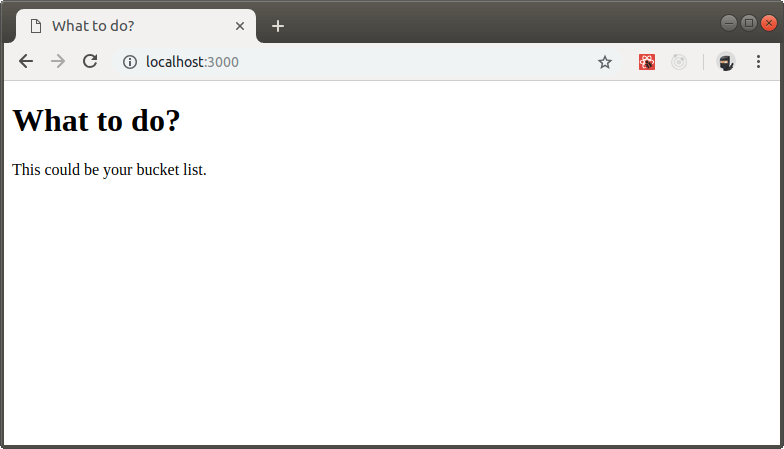

## 4.3 Embedded Expressions

We can embed any JavaScript expression in JSX by wrapping it in curly braces. This is also the way we use variables inside of JSX templates.

By default, React DOM will escape any values in JSX before rendering them. This helps to prevent [XSS attacks](https://developer.mozilla.org/en-US/docs/Glossary/Cross-site_scripting) and we don't have to sanitize user data in the frontend ourselves.

## 4.4 Comments

If you want to use comments in JSX, you have to use the JavaScript multi-line comment version in curly braces.

Remember that nothing can be outside of the single returned element. So no comment can be outside of our Fragment in the following example.

```jsx
import React, { Fragment } from "react";

const Header = props => {
  return (
    <Fragment>
      {/* Our first comment */}
      <h1>What to do?</h1>
      <span className="tagline">This could be your bucket list.</span>
    </Fragment>
  );
};

export default Header;
```

# 5. Adding SCSS for styles

As we're going to use the Bootstrap framework in our demo application, it's a good idea to extend our setup with a SASS/SCSS loader. We will use the package `node-sass`.

## 5.1 Install additional package

We need some additional packages, that we install by running the following command. Bootstrap is used to create the basic laout of our application in the next steps.

```bash
npm install --save-dev node-sass bootstrap
```

## 5.2 Create the stylesheet file

With the SASS/SCSS loader in place, we can now add our SCSS file as `src/sass/style.scss` with some basic styling in it.

```
src/sass/style.scss
```

```SCSS
@import "../../node_modules/bootstrap/scss/bootstrap";

body {
  margin: 1rem;
}

.header {
  margin-bottom: 1rem;
}
```

## 5.3 Import the stylesheet file

One final step is needed, before we can restart our application. We need to import the stylesheet into our `src/index.js` so that it's loaded by webpack.

```
src/index.js
```

```jsx
import React from "react";
import { render } from "react-dom";
import Header from "./components/Header";

import "./sass/style.scss";

render(<Header />, document.querySelector("#main"));
```

## 5.4 Start the application

Now we can start the application again.

```bash
npm start
```

The result should now look like this:

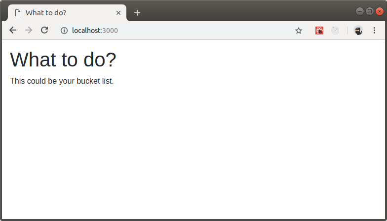


# 6. Create a typical app layout with components

Most React applications use a `<App>` component as their entry point for handling state, routing and more. So let's do this too and add our component for the todo list widget.

## 6.2 Create the `ToDoList` component

```
src/components/ToDoList.js
```

```jsx
import React from "react";

class ToDoList extends React.Component {
  render() {
    return (
      <div className="alert alert-info">
        This is where the ToDo items will be.
      </div>
    );
  }
}

export default ToDoList;
```


## 6.3 Create the `App` component

Now, as we have the components that we want to load on the page, let's create the App that includes them.

```
src/components/App.js
```

```jsx
import React from "react";
import Header from "./Header";
import ToDoList from "./ToDoList";

class App extends React.Component {
  render() {
    return (
      <div className="container">
        <Header />
        <ToDoList />
      </div>
    );
  }
}

export default App;
```

Next we need to use the new component in the `src/index.js` file.

```
src/index.js
```

```jsx
import React from "react";
import { render } from "react-dom";
import App from "./components/App";

import "./sass/style.scss";

render(<App />, document.querySelector("#main"));
```

## 6.4 Update the `Header` component

We need a small update to the `Header` component, so that the styles are all applied and there's a distance to the new `ToDoList` component. We will replace the `<Fragment>` with a `<header>` element.

```
src/components/Header.js
```

```jsx
import React from "react";

class Header extends React.Component {
  render() {
    return (
      <header className="header">
        <h1>What to do?</h1>
        <span className="tagline">This could be your bucket list.</span>
      </header>
    );
  }
};

export default Header;
```

The result of our new app layout and the changes that we made should result in this:

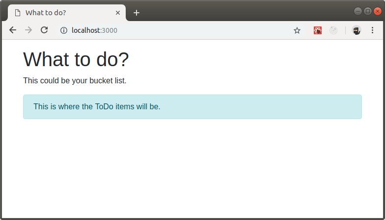


# 7. Passing data with Props

When we are using components in React, the framework passes JSX attributes to this component as a single object called `props`.

## 7.1 Update the `App` component

Let's look at our `App` component and add a prop to the `Header` component, that we are using inside. The tagline below our `h1` element will be dynamic, when we are done.

```
src/components/App.js
```

```jsx
import React from "react";
import Header from "./Header";
import ToDoList from "./ToDoList";

class App extends React.Component {
  render() {
    return (
      <div className="container">
        <Header tagline="This could be your shopping list." />
        <ToDoList />
      </div>
    );
  }
};

export default App;
```

We are passing the `tagline` prop to the `Header` component. Great. So let us now use this prop inside of the component.

## 7.2 Update the `Header` component

All class components have lifecycle methods defined by React and can also contain user-defined methods. For things coming from React, the `this` keyword will always refer to a single instance of the component. For your own methods you have to care about the scope yourself and we will demonstrate this later.

The props of an instance are stored in the `this.props` property.

Whether you declare a component as a function or a class, it must never modify its own props.

Such functions are called “pure” because they do not attempt to change their inputs, and always return the same result for the same inputs.

```
src/components/Header.js
```

```jsx
import React from "react";

class Header extends React.Component {
  render() {
    return (
      <header className="header">
        <h1>What to do?</h1>
        <span className="tagline">{this.props.tagline}</span>
      </header>
    );
  }
}

export default Header;
```

The tagline of our application should now be changed from "This could be your bucket list." to "This could be your shopping list.". We can use the same component with different taglines now, so props are a good way to create dynamic components.

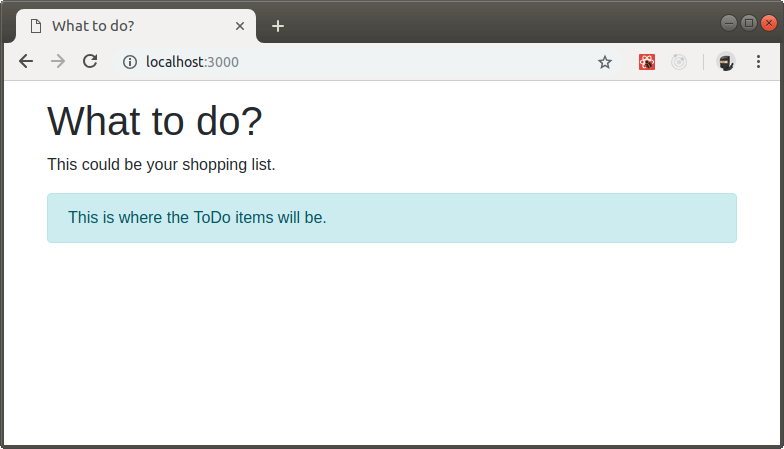


## 8. Stateless functional components

As our header does not need any "special" behaviour or methods, we can use the __stateless functional__ way to write a component. This will not use the `React.component` class, load faster and use less memory.

Let's rewrite our `Header` component and check how that works. The result is an exported function that returns the JSX of our component.

Be aware that you need to use `props` instead of `this.props` as props are passed as a parameter of the function now.

```
src/components/Header.js
```

```jsx
import React from "react";

const Header = props => {
  return (
    <header className="header">
      <h1>What to do?</h1>
      <span className="tagline">{props.tagline}</span>
    </header>
  );
};

export default Header;
```


# 9. Routing with React Router

Every application should have some routes for showing a 404 page and more. In our case we will add a simple FAQ page as with the route `/help`.

## 9.1 Create `Help` component

Our `Help` component will be a template for a manual that helps users to use the application.

```
src/components/Help.js`
```

```jsx
import React from "react";
import Header from "./Header";

class Help extends React.Component {
  componentDidMount() {
    document.title = "Help | What to do?";
  }

  render() {
    return (
      <div className="container">
        <Header tagline="Your questions will be answered here." />
        <dl>
          <dt>Where is the data stored?</dt>
          <dd>We store all information in your browser's LocalStorage.</dd>
        </dl>
      </div>
    );
  }
}

export default Help;
```

Did you notice the new ```componentDidMount()``` method? This is one of a react component's [Lifecycle Methods](https://reactjs.org/docs/react-component.html#the-component-lifecycle). The ```componentDidMount()``` method is invoked immediately after a component is mounted. All initialization that requires DOM nodes should go here and it's also a good place to set our page title (defined by the &lt;title&gt; element).

## 9.2 Create `NotFound` component

For all routes that don't exist we will show a simple 404 page, telling the user that we can't show him the desired result.

```
src/components/NotFound.js
```

```jsx
import React from "react";
import Header from "./Header";

class NotFound extends React.Component {
  componentDidMount() {
    document.title = "Error 404 | What to do?";
  }

  render() {
    return (
      <div className="container">
        <Header tagline="404 -  Page not found!" />
        <div className="alert alert-warning">
          <strong>
            Ooops .... sorry!<br />
          </strong>
          The requested page could not be found.
        </div>
      </div>
    );
  }
}

export default NotFound;
```

## 9.3 Create `Router` component

Now let's create the `Router` component that will load different parts of the application based on the URL that is used.

```
src/component/Router.js
```

```jsx
import React from "react";
import { BrowserRouter, Route, Switch } from "react-router-dom";
import App from "./App";
import Help from "./Help";
import NotFound from "./NotFound";

const Router = () => (
  <BrowserRouter>
    <Switch>
      <Route exact path="/" component={App} />
      <Route path="/help" component={Help} />
      <Route component={NotFound} />
    </Switch>
  </BrowserRouter>
);

export default Router;
```

We imported 3 new components from the `react-router-dom` package, that we need to built the simple routing for our application.

| Component       | Description                                                                                                                         |
| :-------------- | :---------------------------------------------------------------------------------------------------------------------------------- |
| `BrowserRouter` | A router that uses the HTML5 history API (`pushState`, `replaceState` and the `popstate` event) to keep the UI in sync with the URL |
| `Switch`        | Renders the first matching route exclusively.                                                                                       |
| `Route`         | Renders some UI when a location matches the route's path.                                                                           |

The first route is used for our homepage, showing the main application (by using the `App` component).

The second route uses the `Help` component.

The third route shows the 404 page for all URL that didn't match any other route before. 

## 9.4 Load the Router

Now that we've got created the needed `Route` component, let's load it in our `src/index.js` file and replace the `App` component there.

```
src/index.js
```

```jsx
import React from "react";
import { render } from "react-dom";
import Router from "./components/Router";

import "./sass/style.scss";

render(<Router />, document.querySelector("#main"));
```

With our new routing setup, we should be able see the new pages, in our application, by changing the URL. Look at the 2 examples below and check your own results.

__Help Page__

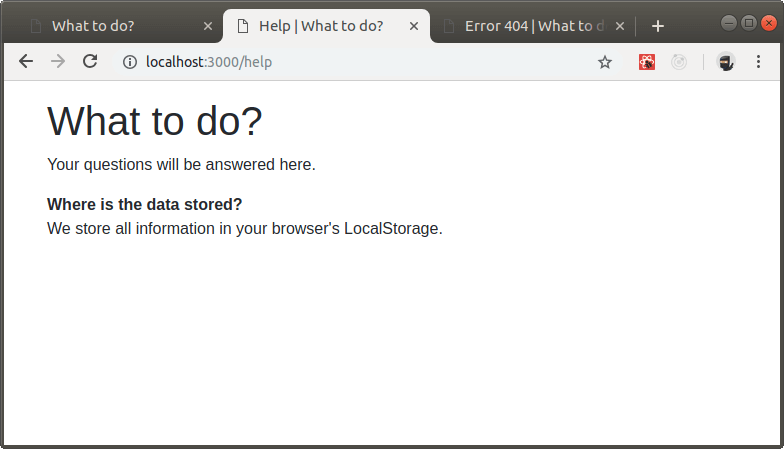

__404 Page__

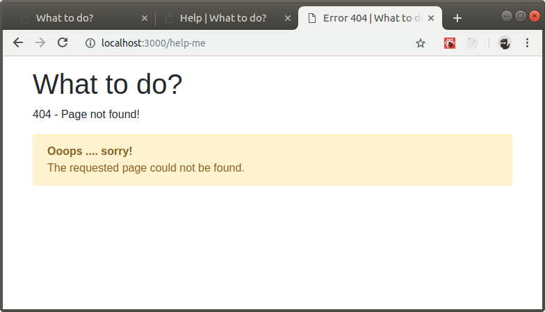


# 10. Helper Functions

There are functions from time to time that we would like to use in the full application and we will create a `src/helpers.js` file for this purpose.

Let's start with a simple function to return a random tagline for our header.

```
src/helpers.js
```

```jsx
export function randomArrayItem(data) {
  return data[Math.floor(Math.random() * data.length)];
}

export function getRandomTagline() {
  const taglines = [
    "This could be your bucket list.",
    "This could be your shopping list.",
    "This could be your project milestone list."
  ];

  return randomArrayItem(taglines)
}
```

We can use the new function to change our tagline on every pageload. Therefore we need to import the `getRandomTagline()` function from our helper file.

As we learned how to create stateless functional components before, let's also implement this for the `App` component to optimize performance.

```
src/components/App.js
```

```jsx
import React from "react";
import Header from "./Header";
import ToDoList from "./ToDoList";
import { getRandomTagline } from "../helpers.js";

class App extends React.Component {
  render() {
    return (
      <div className="container">
        <Header tagline={getRandomTagline()} />
        <ToDoList />
      </div>
    );
  }
};

export default App;
```

As a result you should see a different tagline evertime you reload the application in your browser.

Now that we know it works, let's remove this funny feature which could become a bit annoying, when you use the todo list every day. ;)

```
src/components/App.js
```

```jsx
import React from "react";
import Header from "./Header";
import ToDoList from "./ToDoList";

class App extends React.Component {
  render() {
    return (
      <div className="container">
        <Header tagline="Here are all the next tasks." />
        <ToDoList />
      </div>
    );
  }
};

export default App;
```

# 11. Events and Binding

Events in React are very similar to the Vanilla JS or jQuery events. The biggest difference is that React wraps events in something called a Synthetic Event that ensures it works on all browsers and all devices, so that the developer doesn’t have to care about that.

All React events are camelCase, rather than lowercase.

[Event Documentation on reactjs.org](https://reactjs.org/docs/events.html)

## 11.1 Create a `ToDoForm` component

Let's create a `ToDoForm` component that shows and handles the form we need to add new todo items to our list. The form will check if the input is empty and add the new item otherwise.

```
src/components/ToDoForm.js
```

```jsx
import React from "react";

class ToDoForm extends React.Component {
  render() {
    return (
      <form className="input-group my-3">
        <input
          className="form-control"
          type="text"
          placeholder="Add a new to-do item ..."
        />
        <div className="input-group-append">
          <button className="btn btn-outline-secondary" type="submit">
            <i className="fas fa-plus" aria-hidden="true" />&nbsp;Add item
          </button>
        </div>
      </form>
    );
  }
}

export default ToDoForm;

```

Next we'll add the form to our `App` component.

```
src/components/App.js
```

```jsx
import React from "react";
import Header from "./Header";
import ToDoForm from "./ToDoForm";
import ToDoList from "./ToDoList";

class App extends React.Component {
  render() {
    return (
      <div className="container">
        <Header tagline="Here are all the next tasks." />
        <ToDoForm />
        <ToDoList />
      </div>
    );
  }
};

export default App;
```

The result should look like this:

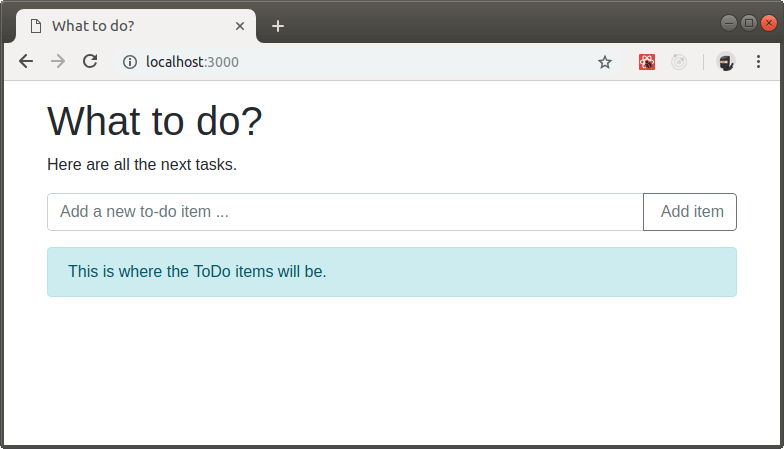

## 11.2 Add an event handler

Now, that we've got the form in our application, we will ad an event handler to react on its submit. Remember that a form submit can be fired in 2 different ways. First by clicking on a submit button (in our case "Add item") and second by pressing [Enter] in any input field (in our case the item text).

```
src/components/ToDoForm.js
```

```jsx
import React from "react";

class ToDoForm extends React.Component {
  handleSubmit() {
    e.preventDefault();
    console.log(`Create new item`);
  }

  render() {
    return (
      <form className="input-group my-3" onSubmit={this.handleSubmit}>
        <input
          className="form-control"
          name="name"
          type="text"
          placeholder="Add a new to-do item ..."
        />
        <div className="input-group-append">
          <button className="btn btn-outline-secondary" type="submit">
            <i className="fas fa-plus" aria-hidden="true" />&nbsp;Add item
          </button>
        </div>
      </form>
    );
  }
}

export default ToDoForm;
```

What did we change?

1. We added a method `handleSubmit` to our class, that retrieves the event we catch as the first argument. When this method is called, we prevent the submit from doing the default (sending the form and reloading the page) and log a simple message to the console.
1. We added the `onSubmit` event to the `<form>` element and told React to call our `handleSubmit` as a handler, when it is fired.

Give it a try! Click on the "Add item" button and check your Chrom developer console. You should see the message "Create new item".

## 11.3 Add a reference

If we want to get the value of input elements when submitting a form, we need to create a reference first. Each input gets its own reference, which is only one in our case, as there's only the text input.

References are created as properties of our class, by using the `React.createRef()` method.

An important thing to note is that we need to change the binding of `this` for our event handler, so that we can access the instance of our component. Therefore we will extend the constructor of our component class.

Let's add the reference in our `ToDoForm` component.

```
src/components/ToDoForm.js
```

```jsx
import React from "react";

class ToDoForm extends React.Component {
  constructor(props) {
    super(props);

    this.handleSubmit = this.handleSubmit.bind(this);
  }

  textInput = React.createRef();

  handleSubmit(e) {
    e.preventDefault();
    console.log(`Create new item: ${this.textInput.current.value}`);
  }

  render() {
    return (
      <form className="input-group my-3" onSubmit={this.handleSubmit}>
        <input
          className="form-control"
          name="name"
          type="text"
          placeholder="Add a new to-do item ..."
          ref={this.textInput}
        />
        <div className="input-group-append">
          <button className="btn btn-outline-secondary" type="submit">
            <i className="fas fa-plus" aria-hidden="true" />&nbsp;Add item
          </button>
        </div>
      </form>
    );
  }
}

export default ToDoForm;

```

What did we change?

1. We extended the constructor to set the binding of `this` for our event handler.
1. We created the reference `textInput` with `React.createRef()`.
1. We added the reference to the input field, by using the `ref` attribute.
1. We added the value of the input reference to our console message in the event handler.

When you open the Chrome dev console, insert a text in the input field and press the button, you should see the following:

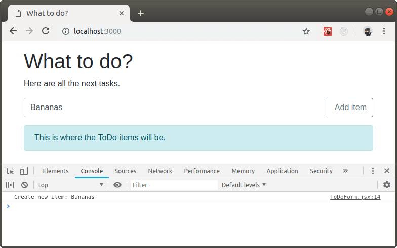

Great! But let's improve our code style a bit and use an alternative to the oldschool binding that we have right now. As we're using the `react scripts` module, which has babel inside, we are able to use an easier ES6 syntax without modifying the constructor.

```
src/components/ToDoForm.js
```

```jsx
  handleSubmit = (e) => {
    e.preventDefault();
    console.log(`Create new item: ${this.textInput.current.value}`);
  }
```

# 12. Understanding the state

## 12.1 What is it?

The state is an object storing data that is required by a component or its children.

Neither parent nor child components can know if a certain component is stateful or stateless, and they shouldn’t care whether it is defined as a function or a class.

This is why state is often called local or encapsulated. It is not accessible to any component other than the one that owns and sets it.

A component may choose to pass its state down as props to its child components, which can be especially useful if multiple components need to have a shared state with the same data.

This is commonly called a “top-down” or “unidirectional” data flow. Any state is always owned by some specific component, and any data or UI derived from that state can only affect components “below” them in the tree.

The state is a single source of truth, so we don’t manually update multiple places using the same data, but use the shared state of a parent component instead.

We will use our `App` component to hold the shared state for the `ToDoForm` and the `ToDoList` components, that will both modify the data.

## 12.2 Adding state to the `App`

As described above, we need to have a state for our `App` component, that is shared with its child components, that can update the data.

Let's create the state with our list of todo items. We use an object for the todo items, because the unique identifier of an item will be used as the property key. This way it's very easy to target one specific item that we want to change later.

The official way to set the initial state of a component is to use a `constructor` method, that gets the props as argument and calls the parent constructor by using `super`.

```
src/components/App.js
```

```jsx
import React from "react";
import Header from "./Header";
import ToDoForm from "./ToDoForm";
import ToDoList from "./ToDoList";

class App extends React.Component {
  constructor(props) {
    super(props);

    this.state = {
      toDoItems: {}
    }
  }

  render() {
    return (
      <div className="container">
        <Header tagline="Here are all the next tasks." />
        <ToDoForm />
        <ToDoList />
      </div>
    );
  }
}

export default App;
```

## 12.3 Updating state with mutations

In React and most other JS frontend frameworks, you should never manipulate the state directly. Handle it as if it would be an immutable object, that you never touch.

Instead, we are using mutations, that do the job and are added as functions to our class component. As the state lives in our `App` component, so will the mutations to work with it.

Let's add a mutation to add a new item to the todo list and pass this mutation to the `ToDoForm` component, that will use it when the form is submitted.

As we will use unique identifiers (UUID) for our todo items, let's add a new npm package first, that does the magic for us.

```bash
npm install --save-dev uuid
```

Now we can use that in our component.

```
src/components/App.js
```

```jsx
import React from "react";
import Header from "./Header";
import ToDoForm from "./ToDoForm";
import ToDoList from "./ToDoList";
import uuid from "uuid/v4";

class App extends React.Component {
  constructor(props) {
    super(props);

    this.state = {
      toDoItems: {}
    };
  }

  addToDo = text => {
    const todo = {
      uuid: uuid(),
      text: text,
      done: false
    };

    this.setState(state => {
      state.toDoItems[todo.uuid] = todo;
      return state;
    });
  };

  render() {
    return (
      <div className="container">
        <Header tagline="Here are all the next tasks." />
        <ToDoForm addToDo={this.addToDo} />
        <ToDoList />
      </div>
    );
  }
}

export default App;
```

What are we doing there?

1. We import the uuid module.
1. We add the mutation addToDo.
1. The mutation creates a new todo object and uses `setState()` to add the item to the state.
1. We pass the mutation down to the `ToDoForm` component.
1. React will check which parts of the application need to be re-rendered because of the state change. As we don't have the list of items yet, this is nothing.

The next thing we have to do is to update our `ToDoForm` component, so that it uses the mutation from its parent. Let's upgrade the `handleSubmit()` function.

```
src/components/ToDoForm.js
```

```jsx
  handleSubmit = e => {
    e.preventDefault();
    const text = this.textInput.current.value.trim();
    this.props.addToDo(text);
    e.currentTarget.reset();
  };
```

Now the `handleSubmit()` function will pass the input to the `addToDo()` method of our `App` component class, because we passed that to our `ToDoForm` component as prop with the name `addToDo`. It's good practice to name the prop the same as the function, because it's easier to figure out the relation this way.

We can check if the mutation works by using the React Dev Tools in Chrome. Open the Chrome dev console and switch to the `React` tab. Inside of the `React` tab use the search field to look for the `App` component, where our state for the todo items lives.

You will see an empty `toDoItems` property of the state when the page is initially loaded. Now add a new item, using the form, and check if the state got updated.

If everything works it should look like this, after you added a new item:

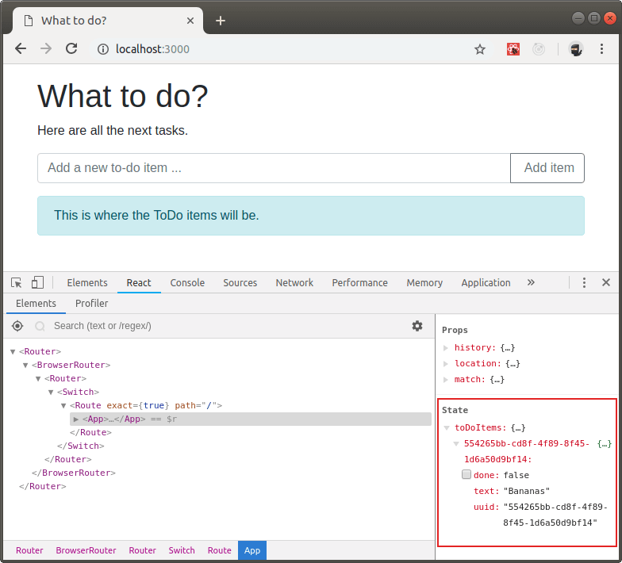


# 13. Displaying state with JSX

Now that we will store some data in our state, let's display the list of items on the screen.

We will create a `ToDoItem` component, that we will use in our already existing `ToDoList` component then. But let's pass the data from our `App` component to the `ToDoList` component first.

```
src/components/App.js
```

```jsx
  render() {
    return (
      <div className="container">
        <Header tagline="Here are all the next tasks." />
        <ToDoForm addToDo={this.addToDo} />
        <ToDoList items={this.state.toDoItems} />
      </div>
    );
  }
```

Now we create the `ToDoItem` component that is very basic for now and will be extended in the next few steps. Let's keep it simple to see if the data is there.

```
src/components/ToDoItem.js
```

```jsx
import React from "react";

class ToDoItem extends React.Component {
  render() {
    return (
      <div className="todo-item">
        {this.props.data.uuid} | {this.props.data.text}
      </div>
    );
  }
}

export default ToDoItem;
```

To loop over our object of items we will use a combination of Object.keys() and Array.map().

With Object.keys() we get all the property names of our object, which are equal and with Array.map() we create a new array of JSX templates that get rendered into our `ToDoItem` component.

```
src/components/ToDoList.js
```

```jsx
import React from "react";
import ToDoItem from "./ToDoItem";

class ToDoList extends React.Component {
  render() {
    return (
      <div className="todo-list">
        <ul className="todo-items">
          {Object.keys(this.props.items).map(uuid => (
            <ToDoItem key={`todo-item-${uuid}`} data={this.props.items[uuid]} />
          ))}
        </ul>
      </div>
    );
  }
}

export default ToDoList;
```

Great! So we should see all items that we add to our list below the form. Try to add a few entries, when the page is loade with your latest changes.

The result should look like this:


# 14. Updating and deleting items

Cool! Now we can add and display items and in the next step we deal with editing and deleting. We will also add a checkbox to mark items as done.

## 14.1 Loading additional styles

Before we start to modify all of our components, we will load some more styles, to enhance our application layout. We want to display the items in a nice list with features to modify and delete them.

As a first step we install [Font Awesome](https://fontawesome.com/) using npm.

```bash
npm install --save-dev @fortawesome/fontawesome-free
```

To load Font Awesome, we need to add it to the `index.js` file.

```
src/index.js
```

```jsx
import React from "react";
import { render } from "react-dom";
import Router from "./components/Router";

import "@fortawesome/fontawesome-free/css/all.css";
import "./sass/style.scss";

render(<Router />, document.querySelector("#main"));
```

Now we will extend the stylesheets for our todo list.

```
src/sass/style.scss
```

```SCSS
@import "../../node_modules/bootstrap/scss/bootstrap";

body {
  margin: 1rem;
}

.header {
  margin-bottom: 1rem;
}

.table-borderless > tbody > tr > td,
.table-borderless > tbody > tr > th,
.table-borderless > tfoot > tr > td,
.table-borderless > tfoot > tr > th,
.table-borderless > thead > tr > td,
.table-borderless > thead > tr > th {
  border: none;
}

.todo-items {
  margin-top: 1rem;
}

.todo-item {
  &:hover {
    background-color: #efefef;
  }

  td {
    padding: 0.25rem 0;

    &:first-child {
      padding-left: 0.5rem;
      border-top-left-radius: 0.25rem;
      border-bottom-left-radius: 0.25rem;
    }

    &:last-child {
      padding-right: 0.5rem;
      border-top-right-radius: 0.25rem;
      border-bottom-right-radius: 0.25rem;
    }
  }

  td.col-action {
    text-align: right;
    padding-right: 0.25rem;

    .icon-remove {
      color: #c0c0c0;
      cursor: pointer;
      padding: 0 0.25rem;

      &:hover {
        color: #bd2d2d;
      }
    }
  }

  input[type="text"] {
    border: 1px solid transparent;
    padding: 0 0.25rem;
    width: 98%;
    height: auto;
  }
}
```


## 14.2 Updating the `App`

We add methods to update the state and pass them as props to the `ToDoList` component.

```
src/components/App.js
```

```jsx
import React from "react";
import Header from "./Header";
import ToDoForm from "./ToDoForm";
import ToDoList from "./ToDoList";
import uuid from "uuid/v4";

class App extends React.Component {
  constructor(props) {
    super(props);

    this.state = {
      toDoItems: {}
    };
  }

  addToDo = text => {
    const todo = {
      uuid: uuid(),
      text: text,
      done: false
    };

    this.setState(state => {
      state.toDoItems[todo.uuid] = todo;
      return state;
    });
  };

  updateToDoText = (uuid, text) => {
    this.setState(state => {
      state.toDoItems[uuid].text = text;
      return state;
    });
  };

  toggleToDoDone = event => {
    const checkbox = event.target;

    this.setState(state => {
      state.toDoItems[checkbox.value].done = checkbox.checked;
      return state;
    });
  };

  removeToDo = uuid => {
    this.setState(state => {
      delete state.toDoItems[uuid];
      return state;
    });
  };

  render() {
    return (
      <div className="container">
        <Header tagline="Here are all the next tasks." />
        <ToDoForm addToDo={this.addToDo} />
        <ToDoList
          items={this.state.toDoItems}
          updateToDoText={this.updateToDoText}
          toggleToDoDone={this.toggleToDoDone}
          removeToDo={this.removeToDo}
        />
      </div>
    );
  }
}

export default App;
```

As you can see we added 3 new methods.

| Method         | Description                                                                                 |
| :------------- | :------------------------------------------------------------------------------------------ |
| updateToDoText | Updates the text of a todo item and will be used for the input field of each item.          |
| toggleToDoDone | (Un)checks a todo item and will be used on click on the checkbox in front of each item.     |
| removeToDo     | Removes a todo item and will be used on click on the remove icon, we will add to each item. |

## 14.3 Updating the `ToDoList`

We take the mutations that we passed from the `ToDoWidget` and pass them to the `ToDoItem`, where they will be used for different events. We will also change from a `ul` to a `table`, to achive the layout we want to have.

```
src/components/ToDoList.js
```

```jsx
import React from "react";
import ToDoItem from "./ToDoItem";

class ToDoList extends React.Component {
  render() {
    return (
      <div className="todo-list">
        <table className="todo-items table table-borderless">
          <tbody>
            {Object.keys(this.props.items).map(uuid => (
              <ToDoItem
                key={`todo-item-${uuid}`}
                data={this.props.items[uuid]}
                updateToDoText={this.props.updateToDoText}
                toggleToDoDone={this.props.toggleToDoDone}
                removeToDo={this.props.removeToDo}
              />
            ))}
          </tbody>
        </table>
      </div>
    );
  }
}

export default ToDoList;
```

## 14.4 Updating the `ToDoItem`

Now let's use the mutations to lift up the state changes that each item can trigger. We can change the text of an item, mark it as done or remove it from the list. Keep care to change the list item to a table row, to match the table of the `ToDoList` component.

We will also add a method to handle every `keyup` event of the text input field, to check if the `keyCode` matches the \[Enter\] key. If the \[Enter\] key is pressed, the `blur()` method of the input elemenent is called, to remove the focus.

```
src/components/ToDoItem.js
```

```jsx
import React from "react";

class ToDoItem extends React.Component {
  handleInputKeyUp(e) {
    // Remove focus, when the [Enter] key is pressed
    if (e.keyCode === 13) {
      e.target.blur();
    }
  }

  render() {
    const todo = this.props.data;

    return (
      <tr className="todo-item" data-id={todo.uuid}>
        <td>
          <div className="custom-control custom-checkbox">
            <input
              className="custom-control-input"
              value={todo.uuid}
              id={`todo-done-${todo.uuid}`}
              type="checkbox"
              checked={todo.done}
              onChange={this.props.toggleToDoDone}
            />
            <label
              className="custom-control-label"
              htmlFor={`todo-done-${todo.uuid}`}
            >
              &nbsp;
            </label>
          </div>
        </td>
        <td className="col-1">
          <input
            type="text"
            className="form-control"
            value={todo.text}
            onChange={e => {
              this.props.updateToDoText(todo.uuid, e.target.value);
            }}
            onKeyUp={e => {
              this.handleInputKeyUp(e);
            }}
          />
        </td>
        <td className="col-action">
          <i
            className="icon-remove far fa-trash-alt"
            onClick={e => this.props.removeToDo(todo.uuid)}
          />
        </td>
      </tr>
    );
  }
}

export default ToDoItem;
```

The result should look like this:

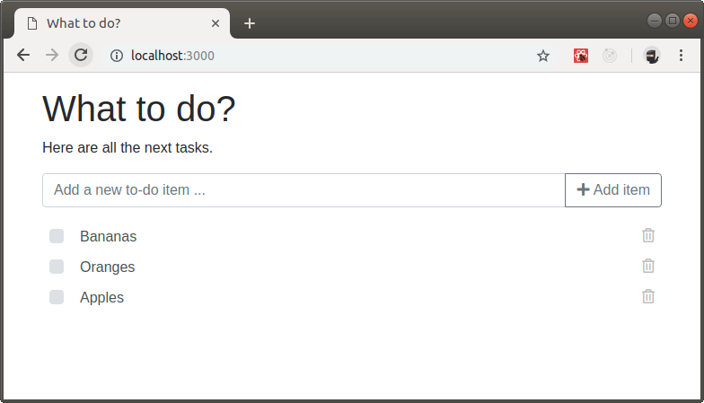


# 15 Persisting state with localStorage

After adding all the mutations to our todo list, we want to store the data in the localStorage, so that we don't loose the data if we leave the page and come back later.

Keep in mind that the localStorage might not be stored forever, depending on your browser settings.

## 15.1 Adding a storage class

As we want to keep our application flexible and we might want to change it to a database or something else later, we will create a class to handle the data storage.

```
src/modules/Storage.js
```

```jsx
class Storage {
  constructor() {
    if (!this.canUseLocalStorage()) {
      throw Error("The local storage is disabled or full!");
    }
  }

  set(key, value) {
    localStorage.setItem(key, value);
  }

  get(key, defaultValue = null) {
    const value = localStorage.getItem(key);

    if (value !== null) {
      return value;
    }

    return defaultValue;
  }

  canUseLocalStorage() {
    var test = "test";

    try {
      localStorage.setItem(test, test);
      localStorage.removeItem(test);
    } catch (e) {
      return false;
    }

    return true;
  }
}

export default new Storage();
```

## 15.2 Updating the `App`

We will load our new `Storage` class and get the stored data in our constructor, before the component is rendered. As the localStorage can only store strings, we need to use the `JSON.stringify()` and `JSON.parse()` methods.

Everytime that the state gets changed, we will update the data stored in localStorage, using the `componentDidUpdate()` lifecycle method.

```
src/components/App.js
```

```jsx
import React from "react";
import Header from "./Header";
import ToDoForm from "./ToDoForm";
import ToDoList from "./ToDoList";
import uuid from "uuid/v4";
import Storage from "../modules/Storage";

class App extends React.Component {
  constructor(props) {
    super(props);

    this.storageKey = "react-todo";
    const old = Storage.get(this.storageKey);

    if (old) {
      this.state = JSON.parse(old);
    } else {
      this.state = {
        toDoItems: {}
      };

      Storage.set(this.storageKey, JSON.stringify(this.state));
    }
  }

  componentDidUpdate() {
    Storage.set(this.storageKey, JSON.stringify(this.state));
  }

  addToDo = text => {
    const todo = {
      uuid: uuid(),
      text: text,
      done: false
    };

    this.setState(state => {
      state.toDoItems[todo.uuid] = todo;
      return state;
    });
  };

  updateToDoText = (uuid, text) => {
    this.setState(state => {
      state.toDoItems[uuid].text = text;
      return state;
    });
  };

  toggleToDoDone = event => {
    const checkbox = event.target;

    this.setState(state => {
      state.toDoItems[checkbox.value].done = checkbox.checked;
      return state;
    });
  };

  removeToDo = uuid => {
    this.setState(state => {
      delete state.toDoItems[uuid];
      return state;
    });
  };

  render() {
    return (
      <div className="container">
        <Header tagline="Here are all the next tasks." />
        <ToDoForm addToDo={this.addToDo} />
        <ToDoList
          items={this.state.toDoItems}
          updateToDoText={this.updateToDoText}
          toggleToDoDone={this.toggleToDoDone}
          removeToDo={this.removeToDo}
        />
      </div>
    );
  }
}

export default App;
```

That's it! Now the state of our application is always synced to localStorage, when it's changed and the user will see the same items as before, when he reloads the page or visits the same page again later.

# 16 Filtering Data

With our full todo application running there's a downside as soon as we get a lot of items in the list.  
Wouldn't it be nice to be able to filter by status of our items and see only undone tasks initially?

Let's add a new `ToDoFilter` component.

## 16.1 Create the `ToDoFilter` component

Our `ToDoFilter` component will include the user interface to set the filter for the `ToDoList` to show either all or only the done / undone items.

The JSX below generates a list of 3 buttons in a Bootstrap button group. We use an array to store our filters, so that we're flexible to extend our solution later and that we don't have to repeat the same code 3 times.

```
src/components/ToDoFilter.js
```

```jsx
import React from "react";

class ToDoFilter extends React.Component {
  filters = ["all", "undone", "done"];

  render() {
    return (
      <div className="todo-filters text-right">
        <div
          className="btn-group btn-group-sm"
          role="group"
          aria-label="Set a filter to show items"
        >
          {this.filters.map(filter => (
            <button
              type="button"
              className={`btn btn-light ${
                this.props.activeFilter === filter ? "active" : ""
              }`}
              onClick={e => {
                this.props.setFilter(filter);
              }}
              key={filter}
            >
              {filter}
            </button>
          ))}
        </div>
      </div>
    );
  }
}

export default ToDoFilter;
```

## 16.2 Update the `App` component

As a next step we need to update our `App` with a state property for the set filter and a function to mutate the new property. We will also load the new `ToDoFilter` component in the `render()` method.

```
src/components/App.js
```

```jsx
import React from "react";
import Header from "./Header";
import ToDoForm from "./ToDoForm";
import ToDoList from "./ToDoList";
import ToDoFilter from "./ToDoFilter";
import uuid from "uuid/v4";
import Storage from "../modules/Storage";

class App extends React.Component {
  constructor(props) {
    super(props);

    this.storageKey = this.props.storageKey || "react-todo";
    const old = Storage.get(this.storageKey);

    if (old) {
      this.state = JSON.parse(old);
    } else {
      this.state = {
        toDoItems: {},
        filter: "undone"
      };

      Storage.set(this.storageKey, JSON.stringify(this.state));
    }
  }

  componentDidUpdate() {
    Storage.set(this.storageKey, JSON.stringify(this.state));
  }

  addToDo = text => {
    const todo = {
      uuid: uuid(),
      text: text,
      done: false
    };

    this.setState(state => {
      state.toDoItems[todo.uuid] = todo;
      return state;
    });
  };

  updateToDoText = (uuid, text) => {
    this.setState(state => {
      state.toDoItems[uuid].text = text;
      return state;
    });
  };

  toggleToDoDone = event => {
    const checkbox = event.target;

    this.setState(state => {
      state.toDoItems[checkbox.value].done = checkbox.checked;
      return state;
    });
  };

  removeToDo = uuid => {
    this.setState(state => {
      delete state.toDoItems[uuid];
      return state;
    });
  };

  setFilter = filter => {
    this.setState(state => {
      state.filter = filter;
      return state;
    });
  };

  render() {
    return (
      <div className="container">
        <Header tagline="Here are all the next tasks." />
        <ToDoForm addToDo={this.addToDo} />
        <ToDoFilter
          activeFilter={this.state.filter}
          setFilter={this.setFilter}
        />
        <ToDoList
          items={this.state.toDoItems}
          filter={this.state.filter}
          updateToDoText={this.updateToDoText}
          toggleToDoDone={this.toggleToDoDone}
          removeToDo={this.removeToDo}
        />
      </div>
    );
  }
}

export default App;
```

## 16.3 Update the `ToDoList` component

Great. We now have our filter stored in the state of the `App` and we pass it to our `ToDoList` component as prop "filter".

The next step is to convert our `ToDoList` component to a stateful one and to filter all todo items, that are passed as props, depending on the active filter. We use a new method `filteredItems()` in our class during rendering. As the `App` component passes the "filter" prop from the state, every click on a filter button will update the props of the `ToDoList` component and trigger a new rendering, so also a filtering.

```
src/components/ToDoList.js
```

```jsx
import React from "react";
import ToDoItem from "./ToDoItem";

class ToDoList extends React.Component {
  filteredItems = () => {
    const filtered = [];

    for (const uuid in this.props.items) {
      const item = this.props.items[uuid];

      if (
        this.props.filter === "all" ||
        (this.props.filter === "done" && item.done === true) ||
        (this.props.filter === "undone" && item.done === false)
      ) {
        filtered.push(item);
      }
    }

    return filtered;
  };

  render() {
    return (
      <div className="todo-list">
        <table className="todo-items table table-borderless">
          <tbody>
            {this.filteredItems().map(item => (
              <ToDoItem
                key={`todo-item-${item.uuid}`}
                data={item}
                updateToDoText={this.props.updateToDoText}
                toggleToDoDone={this.props.toggleToDoDone}
                removeToDo={this.props.removeToDo}
              />
            ))}
          </tbody>
        </table>
      </div>
    );
  }
}

export default ToDoList;
```

The result should look like this:

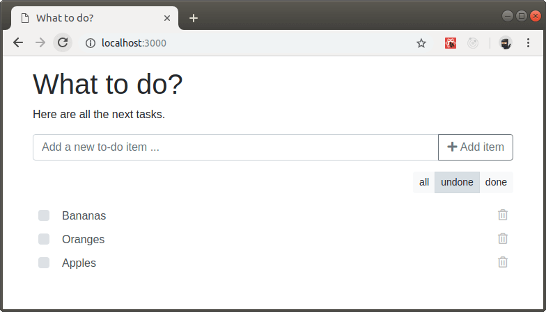

Let's mark the "Oranges" as done and filter the list by "done" afterwards to see if the changes take effect. The item "Oranges" should now be on the list only when it is filtered by "all" or "done".

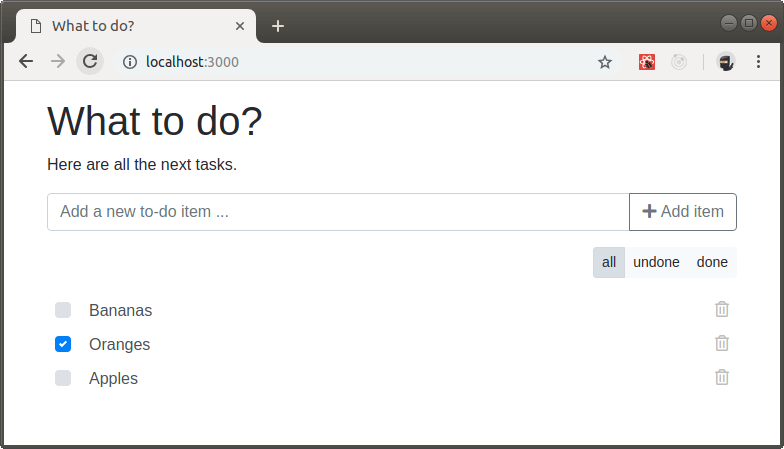

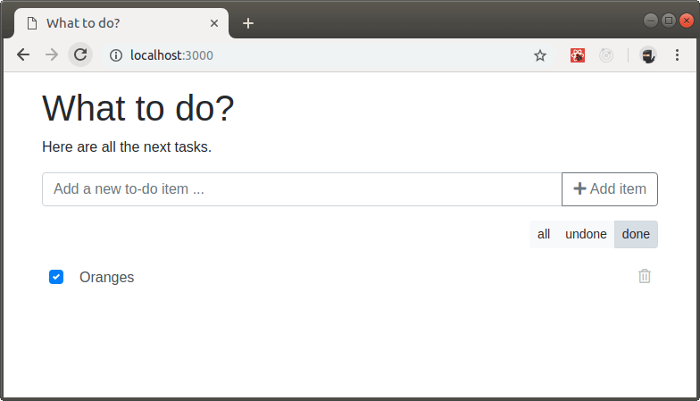

# 17 Introducing Redux

__Important:__  
You don't have to type any code for this chapter. Please read everything carefully and we will implement Redux in the next chapter, when you've learned all the basics that we need.

## 17.1 What it is

Looking at our current ToDo application we can see, that we passed down functions to mutate the state a lot. For example the `ToDoWidget` component has to pass the `updateToDoText`,  `toggleToDoDone` and `removeToDo` functions to the `ToDoList` component.

To reduce the amount of props and to get rid of the need to pass things down through components that don't even need the functions or data, we will use a famous state library called [Redux](https://redux.js.org/).

## 17.2 Actions

Instead of changing the state directly, we used the `setState` method of React. With Redux, each change of our state will be an `action` that gets dispatched. Actions are nothing else than JavaScript objects that explain what happened. Enforcing that every change is described as an action, there's a clear understanding what's going on in the app.

The action to add a todo item looks like this:

```jsx
{ type: "ADD_TODO", text: "Bananas" }
```

And the action to mark a todo item as done, looks like this:

```jsx
{ type: "TOGGLE_TODO_DONE", uuid: "7e151b7c-eaef-46e9-873f-d3cb7e3c353a" }
```

Every action must have a `type` property, which has a string as value that represents the type of the action.
Additionaly there can be any payload needed to resolve the action with a `reducer` that we will learn about next.

## 17.3 Action Creators

Actions are objects created by functions. These functions are called `action creators`.

```jsx
function addToDo(text) {
  return {
    type: "ADD_TODO",
    text
  }
}
```

## 17.4 Reducers

Reducers are __pure__ functions, that take the previous state and an action as arguments and return the next state.
__Always__ return a new state object, instead of mutating the previous one and always return the original state for the default case.

Let's have a quick look at our application state, to have a reference what we're dealing with.

```jsx
{
  filter: "undone",
  toDoItems: {}
}
```

A simple reducer for our todo items, that has only one action implemented right now, looks like this:

```jsx
function toDoItems(state = {}, action) {
  switch (action.type) {
    case "ADD_TODO":
      const id = uuid();
      return {
        ...state,
        [id]: {
          uuid: id,
          text: action.text,
          done: false
        }
      };
    default:
      return state;
  }
}
```

Did you recognize that the name of our reducer is the same as the key of the property we want to modify in our state? This will be very important soon, as we want to split our reducers for different data of the application. Modifying the todo items and setting a filter are two seperate concerns and we don't want to mix everything into one giant reducer.

The "ADD_TODO" action is cloning the state and adding one new object at the end.

A second reducer for our filter looks like this:

```jsx
function filter(state = actions.filters.ALL, action) {
  switch (action.type) {
    case "SET_FILTER":
      return action.filter;
    default:
      return state;
  }
}
```

The "SET_FILTER" action is returning the new state value directly, as it's only a string and we don't need to clone anything.

Both of reducers handle seperate parts of our data. The first one cares about the `toDoItems` property of our staten and the second one about the `filter` property.

## 17.5 The Store

The store is the central object, that will hold the state of our application and it is created by using the `createStore` method of the Redux library. The store brings our actions (that represent the facts about what happened) and the reducers (that update the state according to those actions) together.

It's important to note that you should only have a single store in a Redux application. When you want to split your data handling logic, you'll use reducer composition instead of many stores. That's the reason why we splitted the reducers for the todo items and the filter, as a very basic example of reducer composition.

We will use the `combineReducers` method of Redux, to combine our splitted reducers and pass them to the new created store.

```jsx
import { createStore, combineReducers } from "redux";

// Create our main reducer for the app store
const toDoApp = combineReducers({
  toDoItems,
  filter
})

// Create the store
let store = createStore(toDoApp);
```

# 18 Implementing Redux

To get some insights of the data we store in our application, when Redux is used, we should install the [Redux Dev Tools](https://chrome.google.com/webstore/detail/redux-devtools/lmhkpmbekcpmknklioeibfkpmmfibljd) for Chrome.

## 18.1 Add redux packages

We need to load additional packages, to get redux support in our application.

```bash
npm install --save-dev redux react-redux
```

## 18.2 Create actions

As we know what our state looks like and which actions our application supports, we can create a file to store all of our actions.

We need to create two new folders for our Redux integration.

```
- react-todo-list
  - src
    - actions
    - reducers
```

Now let's create the actions.

```
src/actions/index.js
```

The first thing we'll do in our new file is to define some constants for the different action types that we want to support. This is important, to have only one place in our code where those strings are defined, as we can reference them by their constants.

```jsx
/*
 * Action types
 */

// Filter

export const SET_FILTER = "SET_FILTER";

// Todo Items

export const ADD_TODO = "ADD_TODO";
export const UPDATE_TODO_TEXT = "UPDATE_TODO_TEXT";
export const TOGGLE_TODO = "TOGGLE_TODO";
export const REMOVE_TODO = "REMOVE_TODO";
```

The next step is to add other constants that might be helpful to save in one place. In our example we will store all supported filter settings as an object to reference them from here.

```jsx
/*
 * Other constants
 */
export const filters = {
  ALL: "all",
  DONE: "done",
  UNDONE: "undone"
};
```

And finally we defined our action creators that return our actions.

```jsx
/*
 * Action creators
 */

// Filter

export const setFilter = filter => {
  return { type: SET_FILTER, filter };
};

// Todo items

export const addToDo = text => {
  return { type: ADD_TODO, text };
};

export const updateToDoText = (uuid, text) => {
  return { type: UPDATE_TODO_TEXT, uuid, text };
};

export const removeToDo = uuid => {
  return { type: REMOVE_TODO, uuid };
};

export const toggleToDo = uuid => {
  return { type: TOGGLE_TODO, uuid };
};
```

## 18.3 Create reducers

With all actions in place we need to define the reducers, that manage all state changes.
Remember that we always need to clone the state instead of overwriting?

```
src/reducers/index.js
```

We use the new ES6 syntax `import * as actions` to get all the actions as properties of an object `actions`.
We will need the uuid package when creating new todo items later.

```jsx
import { combineReducers } from "redux";
import * as actions from "../actions/index";
import uuid from "uuid/v4";
```

Let's add the reducer for the `filter` property of our state first.

```jsx
function filter(state = actions.filters.ALL, action) {
  switch (action.type) {
    case actions.SET_FILTER:
      return action.filter;
    default:
      return state;
  }
}
```

As you can see there's our action to set the filter to a new value and the default is returning the original state. The reducer also has a default state set to the filter constant we created in the `src/actions/index.js` file.

Now let's add the more complex reducer for our todo items.

```jsx
function toDoItems(state = {}, action) {
  switch (action.type) {
    case actions.ADD_TODO:
      const id = uuid();

      return {
        ...state,
        [id]: {
          uuid: id,
          text: action.text,
          done: false
        }
      };
    case actions.UPDATE_TODO_TEXT:
      return {
        ...state,
        [action.uuid]: {
          ...state[action.uuid],
          text: action.text
        }
      };
    case actions.TOGGLE_TODO:
      return {
        ...state,
        [action.uuid]: {
          ...state[action.uuid],
          done: !state[action.uuid].done
        }
      };
    case actions.REMOVE_TODO:
      let nextState = { ...state };
      delete nextState[action.uuid];

      return nextState;
    default:
      return state;
  }
}
```

As a last step we will combine the reducers into a single one, that we will pass to our store later. This is the best way to split the handling of different state properties with their own reducers that could also be splitted into seperate files.

```jsx
const appReducer = combineReducers({
  filter,
  toDoItems
});

export default appReducer;
```

## 18.4 Create store in `index.js`

As our Redux store will be available in the full application, as a single source of truth, we need to create and provide it in our `index.js` file.

We need to import
- the _createStore_ function from the __redux__ package
- the _appReducer_ object from our __src/reducers/index.js__ file
- the `Provider` component from the __react-redux__ package

We will wrap our `Router` component in a new `Provider` component, that gets only the created store as prop.

This way all of our components inside the full application can connect to the store, if they need to.

The second argument of createStore() is only needed if you want to use the [Redux Dev Tools](https://chrome.google.com/webstore/detail/redux-devtools/lmhkpmbekcpmknklioeibfkpmmfibljd) for Chrome.

```
src/index.js
```

```jsx
// React
import React from "react";
import { render } from "react-dom";

// Redux
import { createStore } from "redux";
import { Provider } from "react-redux";
import appReducer from "./reducers/index";

// Components
import Router from "./components/Router";

// Styles
import "@fortawesome/fontawesome-free/css/all.css";
import "./sass/style.scss";

// Create Redux store and initialize the app
const store = createStore(
  appReducer,
  window.__REDUX_DEVTOOLS_EXTENSION__ && window.__REDUX_DEVTOOLS_EXTENSION__()
);

render(
  <Provider store={store}>
    <Router />
  </Provider>,
  document.querySelector("#main")
);
```

## 18.5 Connect the `ToDofilter` component

To use the app store, that we created in our main `index.js` file, we need to connect the components that need it. The `react-redux` package has a _connect()_ method for this purpose, that gets 2 arguments. We will wrap our export into this function.

The first argument is a function that defines which properties of the state should be passed as props to the component. In our case we will pase the saved filter value from the store as prop "filter".

The second argument is an object to pass actions as props to the component. In our case this is the _setFilter_ action, that we defined in the `src/actions/index.js` file.

```
src/components/ToDoFilter.js
```

```jsx
import React from "react";
import { connect } from "react-redux";
import { filters, setFilter } from "../actions/index";

class ToDoFilter extends React.Component {
  render() {
    return (
      <div className="todo-filters text-right">
        <div
          className="btn-group btn-group-sm"
          role="group"
          aria-label="Set a filter to show items"
        >
          {Object.keys(filters).map(filterKey => {
            const filter = filters[filterKey];

            return (
              <button
                type="button"
                className={`btn btn-light ${
                  this.props.filter === filter ? "active" : ""
                }`}
                onClick={e => {
                  this.props.setFilter(filter);
                }}
                key={filterKey}
              >
                {filter}
              </button>
            );
          })}
        </div>
      </div>
    );
  }
}

export default connect(
  state => ({
    filter: state.filter
  }),
  {
    setFilter
  }
)(ToDoFilter);
```

What we did:
1. Import the _connect_ function and the needed actions for this component.
1. Loop through the available filters from our actions file instead of a component property.
1. Wrap our component with the _connect()_ function to get the active filter from state and pass the needed action to update the filter value.

How to test the expected behavior:
1. Open the Redux Dev Tools.
1. Reload the application to its initial state.
1. Change the filter from "all" to "done" or "undone".
1. Check the diff in the Redux Dev Tools, for the SET_FILTER history entry.

The changes should be visible like in the following example:

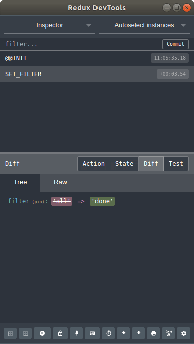

## 18.6 Connect the `ToDoForm` component

The next component to upgrade is the `ToDoForm`, which does not need data from the store, but the action to add a new item.

__Hint:__  
When we don't need state data, we have to be aware of the ES6 implicit return syntax and use a pair of parentheses around the empty object.

```
src/components/ToDoForm.js
```

```jsx
import React from "react";
import { connect } from "react-redux";
import { addToDo } from "../actions/index";

class ToDoForm extends React.Component {
  textInput = React.createRef();

  handleSubmit = e => {
    e.preventDefault();
    const text = this.textInput.current.value.trim();
    this.props.addToDo(text);
    e.currentTarget.reset();
  };

  render() {
    return (
      <form className="input-group my-3" onSubmit={this.handleSubmit}>
        <input
          className="form-control"
          name="name"
          type="text"
          placeholder="Add a new to-do item ..."
          ref={this.textInput}
        />
        <div className="input-group-append">
          <button className="btn btn-outline-secondary" type="submit">
            <i className="fas fa-plus" aria-hidden="true" />&nbsp;Add item
          </button>
        </div>
      </form>
    );
  }
}

export default connect(state => ({}), {
  addToDo
})(ToDoForm);
```

What we did:
1. Import the _connect_ function and the needed action for this component.
1. Wrap our component with the _connect()_ function to pass the needed action to add an item.

How to test the expected behavior:
1. Open the Redux Dev Tools.
1. Reload the application to its initial state.
1. Use the form to add a new todo item you can't see (yet).
1. Check the state in the Redux Dev Tools, for the ADD_TODO history entry.

The new todo item should be visible, like in the following example:

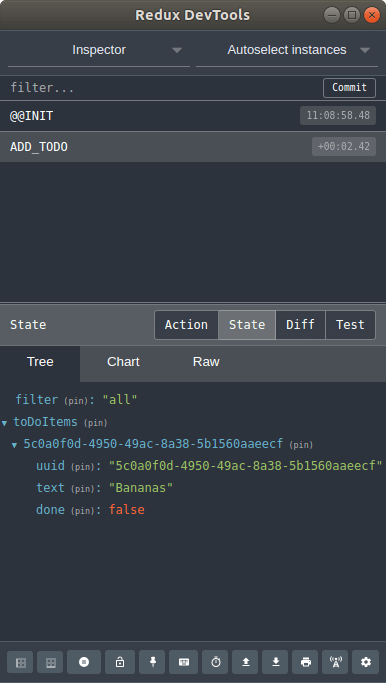

## 18.7 Connect the `ToDoList` component

The next component to upgrade is the `ToDoList`, which needs the todo items and the filter from the store, but no actions.

```
src/components/ToDoList.js
```

```jsx
import React from "react";
import ToDoItem from "./ToDoItem";
import { connect } from "react-redux";

class ToDoList extends React.Component {
  filteredItems = () => {
    let itemsFiltered = [];

    for (const uuid in this.props.items) {
      const item = this.props.items[uuid];

      if (
        this.props.filter === "all" ||
        (this.props.filter === "done" && item.done === true) ||
        (this.props.filter === "undone" && item.done === false)
      ) {
        itemsFiltered.push(item);
      }
    }

    return itemsFiltered;
  };

  render() {
    return (
      <div className="todo-list">
        <table className="todo-items table table-borderless">
          <tbody>
            {this.filteredItems().map(item => {
              return <ToDoItem key={`todo-item-${item.uuid}`} data={item} />;
            })}
          </tbody>
        </table>
      </div>
    );
  }
}

export default connect(state => ({
  items: state.toDoItems,
  filter: state.filter
}))(ToDoList);
```

What we did:
1. Import the _connect_ function.
1. Remove props for functions to mutate state.
1. Wrap our component with the _connect()_ function to pass the todo items and filter from the store.

How to test the expected behavior:
1. Open the Redux Dev Tools.
1. Reload the application to its initial state.
1. Use the form to add a new todo item you should see now.

As the `ToDoItem` component isn't updated yet, the item cannot be checked, editet or deleted.
So let's go to the next step.

## 18.8 Connect the `ToDoItem` component

The next component to upgrade is the `ToDoItem`, which does not neet data from the state, but the actions to check, edit and remove an item.

```
src/components/ToDoItem.js
```

```jsx
import React from "react";
import { connect } from "react-redux";
import { updateToDoText, toggleToDo, removeToDo } from "../actions/index";

class ToDoItem extends React.Component {
  handleInputKeyUp(e) {
    // Remove focus, when the [Enter] key is pressed
    if (e.keyCode === 13) {
      e.target.blur();
    }
  }

  render() {
    const todo = this.props.data;

    return (
      <tr className="todo-item" data-id={todo.uuid}>
        <td>
          <div className="custom-control custom-checkbox">
            <input
              className="custom-control-input"
              value={todo.uuid}
              id={`todo-done-${todo.uuid}`}
              type="checkbox"
              checked={todo.done}
              onChange={e => {
                this.props.toggleToDo(todo.uuid);
              }}
            />
            <label
              className="custom-control-label"
              htmlFor={`todo-done-${todo.uuid}`}
            >
              &nbsp;
            </label>
          </div>
        </td>
        <td className="col-1">
          <input
            type="text"
            className="form-control"
            value={todo.text}
            onChange={e => {
              this.props.updateToDoText(todo.uuid, e.target.value);
            }}
            onKeyUp={e => {
              this.handleInputKeyUp(e);
            }}
          />
        </td>
        <td className="col-action">
          <i
            className="icon-remove far fa-trash-alt"
            onClick={e => this.props.removeToDo(todo.uuid)}
          />
        </td>
      </tr>
    );
  }
}

export default connect(state => ({}), {
  updateToDoText,
  toggleToDo,
  removeToDo
})(ToDoItem);
```

What we did:
1. Import the _connect_ function and the needed actions for this component.
1. Replace _this.props.toggleToDoDone()_ with _this.props.toggleToDo()_.
1. Wrap our component with the _connect()_ function to pass the needed actions.

How to test the expected behavior:
1. Open the Redux Dev Tools.
1. Reload the application to its initial state.
1. Use the form to add a new todo item you should see now.
1. Update the text of the item, using the input field.
1. Check the state in the Redux Dev Tools, for the UPDATE_TODO_TEXT history entry.
1. Mark the item as done, by clicking on the checkbox in front of it.
1. Check the state in the Redux Dev Tools, for the TOGGLE_TODO history entry.
1. Remove the item, by clicking on the trash icon on the right side of it.
1. Check the state in the Redux Dev Tools, for the REMOVE_TODO history entry.

The changes should be visible like in the following example:


## 18.9 Update the `App` component

The last component to upgrade is the `App`, which does not need the Redux store, but will become a lot smaller now.

```
src/components/App.js
```

```jsx
import React from "react";
import Header from "./Header";
import ToDoForm from "./ToDoForm";
import ToDoList from "./ToDoList";
import ToDoFilter from "./ToDoFilter";

class App extends React.Component {
  render() {
    return (
      <div className="container">
        <Header tagline="Here are all the next tasks." />
        <ToDoForm />
        <ToDoFilter />
        <ToDoList />
      </div>
    );
  }
}

export default App;
```

What we did:
1. Remove the _uuid_ and _Storage_ imports.
1. Remove the constructor and all functions to mutate state.
1. Remove almost all passed props inside of the _render()_ method. actions.

## 18.10 Enable localStorage again

As we removed the localStorage in our `App` component, we need to find a better way to sync our global state.
As the old solution is not needed anymore, we can remove the file `src/modules/Storage.js`.

As a replacement we will start with a new file.

```
src/modules/localStorage.js
```

```jsx
export const loadState = () => {
  try {
    const serializedState = localStorage.getItem("react-todo-state");

    if (serializedState === null) {
      return undefined;
    }

    return JSON.parse(serializedState);
  } catch (err) {
    return undefined;
  }
};

export const saveState = state => {
  try {
    const serializedState = JSON.stringify(state);
    localStorage.setItem("react-todo-state", serializedState);
  } catch (err) {
    // ignore write errors
  }
};
```

We export two functions:
1. __loadState()__ which loads the state from the localStorage, if an entry exists.
1. __saveState()__ which saves / updates the state in the localStorage.

With this new module in place, we will extend our main `index.js` file.

```
src/index.js
```

We import the _loadState()_ and _saveState()_ functions we created and pass the _loadState()_ function as argument fo the preloaded state to the call of _createStore()_.

Additionally we subscribe to all changes of the store's state and call our _saveState()_ function with the updated version.

```jsx
// React
import React from "react";
import { render } from "react-dom";

// Redux
import { createStore } from "redux";
import { Provider } from "react-redux";
import appReducer from "./reducers/index";
import { loadState, saveState } from "./modules/localStorage";

// Components
import Router from "./components/Router";

// Styles
import "@fortawesome/fontawesome-free/css/all.css";
import "./sass/style.scss";

// Create Redux store and initialize the app
const store = createStore(
  appReducer,
  loadState(),
  window.__REDUX_DEVTOOLS_EXTENSION__ && window.__REDUX_DEVTOOLS_EXTENSION__()
);

store.subscribe(() => {
  saveState(store.getState());
});

render(
  <Provider store={store}>
    <Router />
  </Provider>,
  document.querySelector("#main")
);
```

## 18.11 The End

__Congratulations - You did it!__

You've finished this nice little introduction and your final result should be a fully working React application that uses Redux for the state and synchronises it with the browser's localStorage.

Have fun coding with React!<br />
